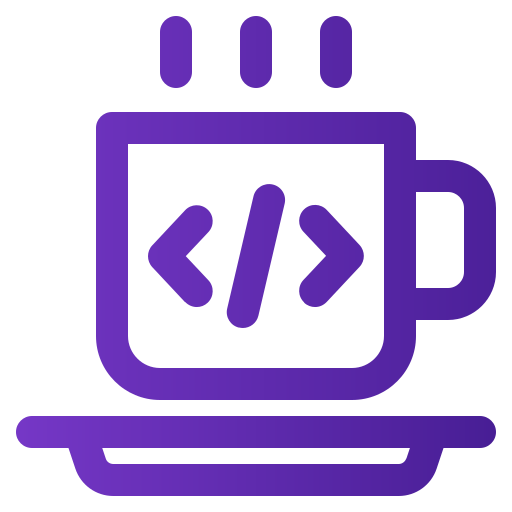

md -->
<a id="readme-top"></a>

<!-- PROJECT SHIELDS -->
[![Contributors][contributors-shield]][contributors-url]
[![Forks][forks-shield]][forks-url]
[![Stargazers][stars-shield]][stars-url]
[![Issues][issues-shield]][issues-url]
[![MIT License][license-shield]][license-url]

<!-- PROJECT LOGO -->
<div align="center">
  <a href="https://github.com/opencloudhub/oss-repo-template">
    
  </a>

  <h1 align="center">Project Name</h1>

  <p align="center">
    A concise and compelling description of your awesome project!
    <br />
    <a href="https://github.com/opencloudhub/oss-repo-template"><strong>Explore the docs »</strong></a>
    <br />
    <br />
    <a href="https://github.com/opencloudhub/oss-repo-template">View Demo</a>
    ·
    <a href="https://github.com/opencloudhub/oss-repo-template/issues/new?template=bug_report.yaml">Report Bug</a>
    ·
    <a href="https://github.com/opencloudhub/oss-repo-template/issues/new?template=feature_request.yaml">Request Feature</a>
  </p>
</div>

<!-- TABLE OF CONTENTS -->
<details>
  <summary>📑 Table of Contents</summary>
  <ol>
    <li><a href="#-about-the-project">About The Project</a></li>
    <li><a href="#-architecture">Architecture</a></li>
    <li><a href="#-features">Features</a></li>
    <li><a href="#-built-with">Built With</a></li>
    <li>
      <a href="#-getting-started">Getting Started</a>
      <ul>
        <li><a href="#prerequisites">Prerequisites</a></li>
        <li><a href="#installation">Installation</a></li>
      </ul>
    </li>
    <li><a href="#-usage">Usage</a></li>
    <li><a href="#-project-structure">Project Structure</a></li>
    <li><a href="#-roadmap">Roadmap</a></li>
    <li><a href="#-contributing">Contributing</a></li>
    <li><a href="#-license">License</a></li>
    <li><a href="#-contact">Contact</a></li>
    <li><a href="#-acknowledgments">Acknowledgments</a></li>
  </ol>
</details>

<!-- ABOUT THE PROJECT -->
## 🚀 About The Project

Brief but compelling description of your project. Why does it exist? What problem does it solve? 

Key points:
* What makes your project stand out?
* What benefits does it provide to users?
* What are the main use cases?

<p align="right">(<a href="#readme-top">back to top</a>)</p>

<!-- FEATURES -->
## ✨ Features

* 🔒 **Feature 1**: Brief description with benefits
* 🔄 **Feature 2**: Brief description with benefits
* 🔍 **Feature 3**: Brief description with benefits

<p align="right">(<a href="#readme-top">back to top</a>)</p>

<!-- ARCHITECTURE -->
## 🏗️ Architecture

<div align="center">
  
</div>

A brief description of the architecture shown in the diagram and how the different components interact.

<p align="right">(<a href="#readme-top">back to top</a>)</p>

<!-- BUILT WITH -->
## 🛠️ Built With

* [![Next][Next.js]][Next-url]
* [![React][React.js]][React-url]
* [![Vue][Vue.js]][Vue-url]
* [![Python][Python.badge]][Python-url]
* [![Docker][Docker.badge]][Docker-url]

<p align="right">(<a href="#readme-top">back to top</a>)</p>

<!-- GETTING STARTED -->
## 📋 Getting Started

### Prerequisites

* [Prerequisite 1]
  ```sh
  installation command
  ```

### Installation

1. Clone the repository
   ```sh
   git clone https://github.com/opencloudhub/your-repo-name.git
   ```
2. Install dependencies
   ```sh
   npm install
   ```
3. Configure settings
   ```sh
   cp .env.example .env
   # Edit .env file with your settings
   ```

<p align="right">(<a href="#readme-top">back to top</a>)</p>

<!-- USAGE -->
## 💻 Usage

Show useful examples of how to use your project. Include code examples, screenshots, or links to demos.

```python
# Example code
import your_package

result = your_package.amazing_function()
print(result)
```

<p align="right">(<a href="#readme-top">back to top</a>)</p>

<!-- PROJECT STRUCTURE -->
## 📁 Project Structure

```
.
├── CODE_OF_CONDUCT.md    # Community guidelines
├── CONTRIBUTING.md       # Contribution guidelines
├── .github/              # GitHub-specific files
│   ├── ISSUE_TEMPLATE/   # Issue templates
│   ├── workflows/        # GitHub Actions
│   └── PULL_REQUEST_TEMPLATE.md
├── src/                  # Source code
├── tests/                # Test suite
├── docs/                 # Documentation
├── LICENSE               # License information
└── README.md             # This file
```

<p align="right">(<a href="#readme-top">back to top</a>)</p>

<!-- ROADMAP -->
## 🗺️ Roadmap

- [x] Feature 1
- [x] Feature 2
- [ ] Feature 3
  - [ ] Subfeature A
  - [ ] Subfeature B

See the [open issues](https://github.com/opencloudhub/oss-repo-template/issues) for a full list of proposed features and known issues.

<p align="right">(<a href="#readme-top">back to top</a>)</p>

<!-- CONTRIBUTING -->
## 👥 Contributing

Contributions are what make the open source community such an amazing place to learn, inspire, and create. Any contributions you make are **greatly appreciated**.

Please see our [Contributing Guidelines](/CONTRIBUTING.md) and [Code of Conduct](/CODE_OF_CONDUCT.md) for more details.

### Top contributors

<a href="https://github.com/opencloudhub/oss-repo-template/graphs/contributors">
  
</a>

<p align="right">(<a href="#readme-top">back to top</a>)</p>

<!-- LICENSE -->
## 📄 License

Distributed under the MIT License. See [LICENSE](/LICENSE) for more information.

<p align="right">(<a href="#readme-top">back to top</a>)</p>

<!-- CONTACT -->
## 📬 Contact

Your Name - [@your_twitter](https://twitter.com/your_username) - email@example.com

Project Link: [https://github.com/opencloudhub/oss-repo-template](https://github.com/opencloudhub/oss-repo-template)

<p align="right">(<a href="#readme-top">back to top</a>)</p>

<!-- ACKNOWLEDGMENTS -->
## 🙏 Acknowledgments

* [Choose an Open Source License](https://choosealicense.com)
* [GitHub Emoji Cheat Sheet](https://www.webpagefx.com/tools/emoji-cheat-sheet)
* [Img Shields](https://shields.io)

<p align="right">(<a href="#readme-top">back to top</a>)</p>

<!-- MARKDOWN LINKS & IMAGES -->
[contributors-shield]: https://img.shields.io/github/contributors/opencloudhub/oss-repo-template.svg?style=for-the-badge
[contributors-url]: https://github.com/opencloudhub/oss-repo-template/graphs/contributors
[forks-shield]: https://img.shields.io/github/forks/opencloudhub/oss-repo-template.svg?style=for-the-badge
[forks-url]: https://github.com/opencloudhub/oss-repo-template/network/members
[stars-shield]: https://img.shields.io/github/stars/opencloudhub/oss-repo-template.svg?style=for-the-badge
[stars-url]: https://github.com/opencloudhub/oss-repo-template/stargazers
[issues-shield]: https://img.shields.io/github/issues/opencloudhub/oss-repo-template.svg?style=for-the-badge
[issues-url]: https://github.com/opencloudhub/oss-repo-template/issues
[license-shield]: https://img.shields.io/github/license/opencloudhub/oss-repo-template.svg?style=for-the-badge
[license-url]: https://github.com/opencloudhub/oss-repo-template/blob/master/LICENSE
[Next.js]: https://img.shields.io/badge/next.js-000000?style=for-the-badge&logo=nextdotjs&logoColor=white
[Next-url]: https://nextjs.org/
[React.js]: https://img.shields.io/badge/React-20232A?style=for-the-badge&logo=react&logoColor=61DAFB
[React-url]: https://reactjs.org/
[Vue.js]: https://img.shields.io/badge/Vue.js-35495E?style=for-the-badge&logo=vuedotjs&logoColor=4FC08D
[Vue-url]: https://vuejs.org/
[Python.badge]: https://img.shields.io/badge/Python-3776AB?style=for-the-badge&logo=python&logoColor=white
[Python-url]: https://www.python.org/
[Docker.badge]: https://img.shields.io/badge/Docker-2496ED?style=for-the-badge&logo=docker&logoColor=white
[Docker-url]: https://www.docker.com/